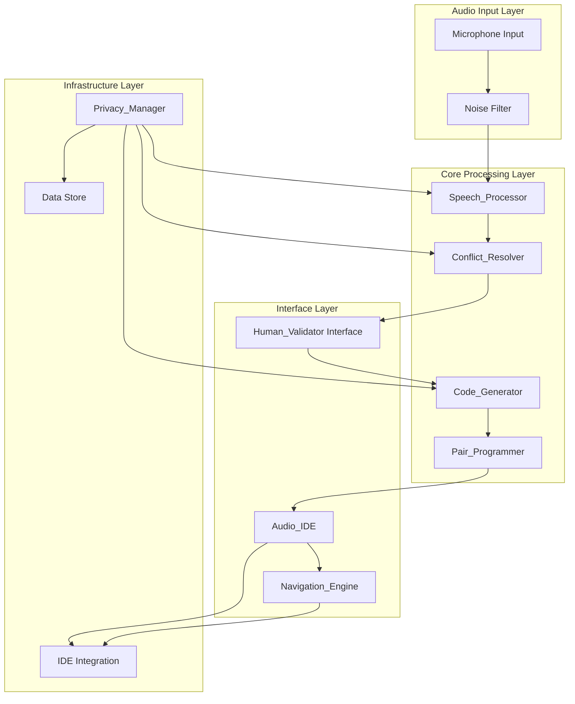

# Design Document: Cognitive Audio IDE

## Overview

The Cognitive Audio IDE is a privacy-preserving, voice-first AI system that transforms spoken developer discussions into structured code while providing accessible audio-based development tools. The system operates entirely locally to ensure privacy, supports multi-speaker conversations, and provides educational pair programming capabilities.

The architecture follows a modular design with six core components that work together to capture speech, analyze intent, resolve conflicts, generate code, provide navigation, and maintain privacy. The system is designed as a prototype-level implementation suitable for hackathon development while maintaining extensibility for future enhancements.

## Architecture

### High-Level Architecture



### Component Interaction Flow

1. **Speech Capture**: Microphone input → Noise filtering → Speech processing
2. **Intent Analysis**: Structured text → Conflict detection → Human validation
3. **Code Generation**: Validated decisions → Code drafts → Pair programming feedback
4. **Audio Navigation**: Generated code → Audio descriptions → IDE integration
5. **Privacy Management**: All components → Local encryption → Secure storage

## Components and Interfaces

### 1. Speech_Processor

**Purpose**: Converts multi-speaker audio input into structured text with speaker identification and intent extraction.

**Core Responsibilities**:
- Real-time speech-to-text conversion using local models
- Speaker diarization and identification
- Intent extraction from conversational text
- Background noise filtering and audio preprocessing

**Technical Implementation**:
- **Speech Recognition**: OpenAI Whisper (local deployment) for high-accuracy transcription
- **Speaker Diarization**: pyannote.audio for speaker separation
- **Intent Extraction**: Local NLP model (spaCy + custom rules) for extracting development intents
- **Audio Processing**: librosa for noise reduction and audio preprocessing

**Key Interfaces**:
```python
class SpeechProcessor:
    def process_audio_stream(self, audio_stream: AudioStream) -> ConversationData
    def identify_speakers(self, audio_segments: List[AudioSegment]) -> SpeakerMap
    def extract_intent(self, structured_text: StructuredText) -> IntentAnalysis
    def filter_noise(self, raw_audio: AudioData) -> AudioData
```

**Data Structures**:
```python
@dataclass
class ConversationData:
    speakers: Dict[str, SpeakerInfo]
    segments: List[ConversationSegment]
    intents: List[DevelopmentIntent]
    timestamp: datetime
    
@dataclass
class ConversationSegment:
    speaker_id: str
    text: str
    confidence: float
    start_time: float
    end_time: float
```

### 2. Conflict_Resolver

**Purpose**: Analyzes conversations for conflicting requirements, competing priorities, and ambiguous decisions that require human validation.

**Core Responsibilities**:
- Detect conflicting requirements in conversations
- Categorize conflicts by type (performance vs security, etc.)
- Rank priorities by frequency and emphasis
- Determine when human validation is required

**Technical Implementation**:
- **Conflict Detection**: Rule-based system with keyword analysis and semantic similarity
- **Priority Ranking**: TF-IDF scoring with emphasis detection (volume, repetition)
- **Decision Trees**: Logic for determining validation requirements
- **Categorization**: Predefined conflict categories with extensible taxonomy

**Key Interfaces**:
```python
class ConflictResolver:
    def analyze_conflicts(self, conversation: ConversationData) -> ConflictAnalysis
    def categorize_conflicts(self, conflicts: List[Conflict]) -> Dict[ConflictType, List[Conflict]]
    def rank_priorities(self, intents: List[DevelopmentIntent]) -> PriorityRanking
    def requires_validation(self, conflict: Conflict) -> bool
```

**Data Structures**:
```python
@dataclass
class ConflictAnalysis:
    conflicts: List[Conflict]
    priorities: PriorityRanking
    validation_required: List[ValidationRequest]
    
@dataclass
class Conflict:
    type: ConflictType
    description: str
    involved_speakers: List[str]
    severity: ConflictSeverity
    proposed_resolution: Optional[str]
```

### 3. Code_Generator

**Purpose**: Produces explainable code drafts from validated decisions with support for multiple programming languages.

**Core Responsibilities**:
- Generate code from validated decisions
- Provide explanations for code sections
- Support multiple programming languages
- Include reasoning in code comments

**Technical Implementation**:
- **Code Generation**: Template-based generation with language-specific adapters
- **Language Support**: Pluggable language modules (Python, JavaScript, Java, etc.)
- **Explanation Engine**: Natural language generation for code explanations
- **Comment Integration**: Automatic insertion of reasoning comments

**Key Interfaces**:
```python
class CodeGenerator:
    def generate_code(self, decisions: ValidatedDecisions, language: ProgrammingLanguage) -> CodeArtifact
    def explain_code_section(self, code_section: CodeSection) -> Explanation
    def generate_pseudocode(self, decisions: ValidatedDecisions) -> PseudoCode
    def add_reasoning_comments(self, code: Code, reasoning: DecisionReasoning) -> AnnotatedCode
```

**Data Structures**:
```python
@dataclass
class CodeArtifact:
    code: str
    language: ProgrammingLanguage
    explanations: Dict[str, Explanation]
    reasoning_comments: List[ReasoningComment]
    metadata: CodeMetadata
```

### 4. Navigation_Engine

**Purpose**: Provides audio-based code navigation and understanding for accessibility, with voice command support.

**Core Responsibilities**:
- Generate audio descriptions of code structure
- Support voice commands for navigation
- Integrate with screen readers
- Provide audio feedback for code changes

**Technical Implementation**:
- **Text-to-Speech**: Local TTS engine (pyttsx3 or similar) for audio output
- **Code Analysis**: AST parsing for structural understanding
- **Voice Commands**: Speech recognition for navigation commands
- **Screen Reader Integration**: Accessibility API integration

**Key Interfaces**:
```python
class NavigationEngine:
    def describe_code_structure(self, code: Code) -> AudioDescription
    def process_voice_command(self, command: VoiceCommand) -> NavigationAction
    def announce_code_changes(self, changes: CodeChanges) -> AudioFeedback
    def integrate_screen_reader(self, screen_reader: ScreenReader) -> None
```

### 5. Pair_Programmer

**Purpose**: AI component that analyzes code logic and asks educational questions to improve coding practices.

**Core Responsibilities**:
- Analyze code logic for improvements
- Ask clarifying questions about intended behavior
- Provide educational explanations
- Adapt questioning style to user experience level

**Technical Implementation**:
- **Logic Analysis**: Static code analysis with pattern recognition
- **Question Generation**: Template-based questioning with context awareness
- **Educational Content**: Curated explanations and best practices
- **Adaptive Behavior**: User profiling for experience-appropriate responses

**Key Interfaces**:
```python
class PairProgrammer:
    def analyze_logic(self, code: Code) -> LogicAnalysis
    def generate_questions(self, analysis: LogicAnalysis, user_level: ExperienceLevel) -> List[Question]
    def provide_explanation(self, topic: Topic, user_level: ExperienceLevel) -> Explanation
    def suggest_improvements(self, code: Code) -> List[Improvement]
```

### 6. Privacy_Manager

**Purpose**: Ensures all data processing respects privacy constraints through local processing and encryption.

**Core Responsibilities**:
- Enforce local-only processing
- Encrypt stored data
- Manage session data lifecycle
- Provide privacy indicators

**Technical Implementation**:
- **Encryption**: AES-256 for data at rest, secure key management
- **Local Processing**: Validation that no external API calls are made
- **Data Lifecycle**: Configurable retention and deletion policies
- **Privacy Indicators**: UI/audio feedback for data processing status

**Key Interfaces**:
```python
class PrivacyManager:
    def encrypt_data(self, data: Any) -> EncryptedData
    def validate_local_processing(self, component: Component) -> bool
    def manage_session_data(self, session: Session, action: DataAction) -> None
    def provide_privacy_status(self) -> PrivacyStatus
```

## Data Models

### Core Data Structures

```python
@dataclass
class Session:
    id: str
    start_time: datetime
    participants: List[Participant]
    conversations: List[ConversationData]
    decisions: List[ValidatedDecision]
    generated_code: List[CodeArtifact]
    
@dataclass
class ValidatedDecision:
    original_conflict: Conflict
    resolution: str
    validator: str
    timestamp: datetime
    confidence: float
    
@dataclass
class DevelopmentIntent:
    type: IntentType
    description: str
    parameters: Dict[str, Any]
    confidence: float
    source_segment: ConversationSegment
```

### Database Schema

The system uses a local SQLite database for session persistence:

```sql
-- Sessions table
CREATE TABLE sessions (
    id TEXT PRIMARY KEY,
    start_time TIMESTAMP,
    end_time TIMESTAMP,
    encrypted_data BLOB
);

-- Conversations table  
CREATE TABLE conversations (
    id TEXT PRIMARY KEY,
    session_id TEXT,
    speaker_data BLOB,
    encrypted_content BLOB,
    FOREIGN KEY (session_id) REFERENCES sessions(id)
);

-- Generated code table
CREATE TABLE generated_code (
    id TEXT PRIMARY KEY,
    session_id TEXT,
    language TEXT,
    encrypted_code BLOB,
    metadata BLOB,
    FOREIGN KEY (session_id) REFERENCES sessions(id)
);
```

## Error Handling

### Error Categories and Strategies

1. **Audio Processing Errors**:
   - Microphone access failures → Graceful degradation with file input
   - Speech recognition errors → Confidence scoring and user confirmation
   - Speaker identification failures → Manual speaker assignment

2. **Analysis Errors**:
   - Intent extraction failures → Fallback to keyword-based analysis
   - Conflict detection errors → Conservative approach requiring validation
   - Priority ranking failures → Equal weighting with user override

3. **Code Generation Errors**:
   - Language support missing → Pseudocode generation
   - Template failures → Basic code structure with manual completion
   - Explanation generation errors → Code-only output with warnings

4. **Integration Errors**:
   - IDE connection failures → Standalone mode operation
   - Screen reader integration issues → Direct audio output
   - File system errors → In-memory operation with export options

### Error Recovery Mechanisms

```python
class ErrorHandler:
    def handle_audio_error(self, error: AudioError) -> RecoveryAction
    def handle_analysis_error(self, error: AnalysisError) -> RecoveryAction
    def handle_generation_error(self, error: GenerationError) -> RecoveryAction
    def provide_user_feedback(self, error: SystemError) -> UserFeedback
```

## Testing Strategy

*A property is a characteristic or behavior that should hold true across all valid executions of a system—essentially, a formal statement about what the system should do. Properties serve as the bridge between human-readable specifications and machine-verifiable correctness guarantees.*

Now I need to analyze the acceptance criteria to determine which ones can be tested as properties. Let me use the prework tool to analyze the testability of each acceptance criterion.

### Correctness Properties

Based on the requirements analysis, the following properties define the expected behavior of the system:

**Property 1: Multi-speaker speech processing**
*For any* audio input containing multiple speakers, the Speech_Processor should correctly identify and distinguish between different speakers in the output
**Validates: Requirements 1.1**

**Property 2: Speech-to-text with speaker identification**
*For any* captured speech input, the Speech_Processor should convert it to structured text that includes accurate speaker identification
**Validates: Requirements 1.2**

**Property 3: Noise filtering preservation**
*For any* audio input with background noise, the Speech_Processor should produce output that maintains speech clarity while filtering noise
**Validates: Requirements 1.3**

**Property 4: Intent extraction completeness**
*For any* processed conversation, the Speech_Processor should extract all identifiable development intents and their associated arguments
**Validates: Requirements 1.4**

**Property 5: Local processing enforcement**
*For any* system operation, the Privacy_Manager should ensure no external network calls are made and all processing occurs locally
**Validates: Requirements 1.5, 7.1, 7.5**

**Property 6: Conflict detection accuracy**
*For any* structured conversation text containing competing priorities, the Conflict_Resolver should identify and report all conflicts
**Validates: Requirements 2.1**

**Property 7: Conflict categorization consistency**
*For any* detected conflict, the Conflict_Resolver should assign it to the appropriate category based on its characteristics
**Validates: Requirements 2.2**

**Property 8: Decision summary completeness**
*For any* completed intent analysis, the System should generate structured summaries that include all identified decisions and trade-offs
**Validates: Requirements 2.3**

**Property 9: Validation requirement detection**
*For any* ambiguous decision scenario, the Conflict_Resolver should correctly identify when human validation is required
**Validates: Requirements 2.4**

**Property 10: Priority ranking accuracy**
*For any* conversation with multiple priorities, the System should rank them correctly based on frequency and emphasis patterns
**Validates: Requirements 2.5**

**Property 11: Conflict presentation completeness**
*For any* identified conflict, the System should present it to the Human_Validator with all necessary context and information
**Validates: Requirements 3.1**

**Property 12: Validation explanation clarity**
*For any* validation request, the System should provide clear explanations that include conflict details and proposed resolutions
**Validates: Requirements 3.2**

**Property 13: Feedback incorporation consistency**
*For any* Human_Validator input, the System should correctly incorporate the feedback into subsequent decision-making processes
**Validates: Requirements 3.3**

**Property 14: Approval gate enforcement**
*For any* code generation request, the System should block execution until explicit Human_Validator approval is received
**Validates: Requirements 3.4**

**Property 15: Decision persistence and consistency**
*For any* approved decision within a session, the System should store it and apply it consistently throughout that session
**Validates: Requirements 3.5**

**Property 16: Code generation from validated decisions**
*For any* set of validated decisions, the Code_Generator should produce code drafts that correctly implement the approved logic
**Validates: Requirements 4.1**

**Property 17: Code explanation completeness**
*For any* generated code, the Code_Generator should provide explanations for all significant code sections
**Validates: Requirements 4.2**

**Property 18: Multi-language code generation**
*For any* project context specifying a programming language, the Code_Generator should generate appropriate code for that language
**Validates: Requirements 4.3**

**Property 19: Reasoning comment inclusion**
*For any* generated code, the Code_Generator should include comments that explain the reasoning behind implementation choices
**Validates: Requirements 4.4**

**Property 20: Dual output capability**
*For any* code generation request, the Code_Generator should be able to produce both pseudocode and actual code implementations as requested
**Validates: Requirements 4.5**

**Property 21: Audio code navigation accuracy**
*For any* code navigation request, the Navigation_Engine should provide audio descriptions that accurately represent the code structure and hierarchy
**Validates: Requirements 5.1, 5.2**

**Property 22: Voice command recognition and execution**
*For any* supported voice command, the Audio_IDE should correctly recognize and execute the corresponding development operation
**Validates: Requirements 5.3**

**Property 23: Code change audio feedback**
*For any* code modification, the Navigation_Engine should provide appropriate audio feedback describing the changes made
**Validates: Requirements 5.4**

**Property 24: Accessibility tool integration**
*For any* supported accessibility tool, the Audio_IDE should integrate correctly and maintain compatibility
**Validates: Requirements 5.5**

**Property 25: Logic analysis and improvement suggestions**
*For any* code being written, the Pair_Programmer should analyze the logic and generate relevant improvement suggestions
**Validates: Requirements 6.1**

**Property 26: Issue-based question generation**
*For any* detected potential issue in code, the Pair_Programmer should generate appropriate clarifying questions about intended behavior
**Validates: Requirements 6.2**

**Property 27: Educational explanation provision**
*For any* suggested improvement, the Pair_Programmer should provide educational explanations that help the user understand the recommendation
**Validates: Requirements 6.3**

**Property 28: Complex logic decomposition**
*For any* complex logic encountered, the Pair_Programmer should break it down into simpler, more understandable components
**Validates: Requirements 6.4**

**Property 29: Adaptive questioning based on experience**
*For any* user interaction, the Pair_Programmer should adapt its questioning style appropriately based on the user's identified experience level
**Validates: Requirements 6.5**

**Property 30: Data encryption enforcement**
*For any* data storage operation, the Privacy_Manager should encrypt all stored conversations and code using strong encryption
**Validates: Requirements 7.2**

**Property 31: Processing status indication**
*For any* data processing or storage operation, the System should provide clear indicators to inform the user of the current status
**Validates: Requirements 7.3**

**Property 32: Session data lifecycle management**
*For any* session end, the Privacy_Manager should offer appropriate options for data deletion or retention
**Validates: Requirements 7.4**

**Property 33: IDE integration functionality**
*For any* supported IDE or code editor, the Audio_IDE should integrate successfully through plugins or APIs and maintain synchronization with development context
**Validates: Requirements 8.1, 8.2**

**Property 34: Keyboard shortcut support**
*For any* defined keyboard shortcut, the System should correctly trigger the associated audio feature or operation
**Validates: Requirements 8.3**

**Property 35: Error feedback provision**
*For any* system error, the System should provide clear audio and text feedback that describes the issue and potential resolution steps
**Validates: Requirements 8.4**

### Testing Strategy

The Cognitive Audio IDE requires a comprehensive testing approach that combines unit testing for specific scenarios with property-based testing for universal behaviors. This dual approach ensures both concrete functionality and general correctness across the wide range of inputs the system will encounter.

**Unit Testing Approach:**
- **Component Integration Tests**: Verify that components work together correctly at integration points
- **Edge Case Testing**: Test boundary conditions like empty audio input, single-speaker scenarios, and malformed data
- **Error Condition Testing**: Verify proper error handling for microphone failures, processing errors, and invalid inputs
- **Specific Example Testing**: Test concrete scenarios like known conversation patterns and expected code generation outputs

**Property-Based Testing Configuration:**
- **Testing Framework**: Use Hypothesis (Python) for property-based testing with minimum 100 iterations per property
- **Audio Input Generation**: Generate synthetic audio data with varying characteristics (multiple speakers, noise levels, speech patterns)
- **Conversation Generation**: Create structured conversation data with known intents, conflicts, and priorities
- **Code Generation Testing**: Generate various decision sets and verify code output correctness
- **Privacy Testing**: Monitor system behavior to ensure no external network calls during processing

**Test Data Management:**
- **Synthetic Audio**: Generate test audio with controlled characteristics for reproducible testing
- **Conversation Corpus**: Maintain a corpus of developer conversations with known analysis results
- **Code Examples**: Curated code examples in multiple languages for generation testing
- **Privacy Validation**: Network monitoring tools to verify local-only processing

**Integration Testing:**
- **IDE Plugin Testing**: Test integration with popular IDEs (VS Code, IntelliJ, Vim)
- **Accessibility Testing**: Verify screen reader compatibility and audio navigation accuracy
- **Performance Testing**: Ensure responsive performance with large codebases and long conversations
- **Cross-Platform Testing**: Verify functionality across different operating systems

Each property-based test must be tagged with a comment referencing its corresponding design property:
```python
# Feature: cognitive-audio-ide, Property 1: Multi-speaker speech processing
def test_multi_speaker_identification(audio_with_multiple_speakers):
    # Test implementation
```

The testing strategy emphasizes early detection of issues through continuous property validation while maintaining comprehensive coverage of edge cases and integration scenarios. This approach is particularly important for an accessibility-focused system where reliability and consistency are critical for user experience.